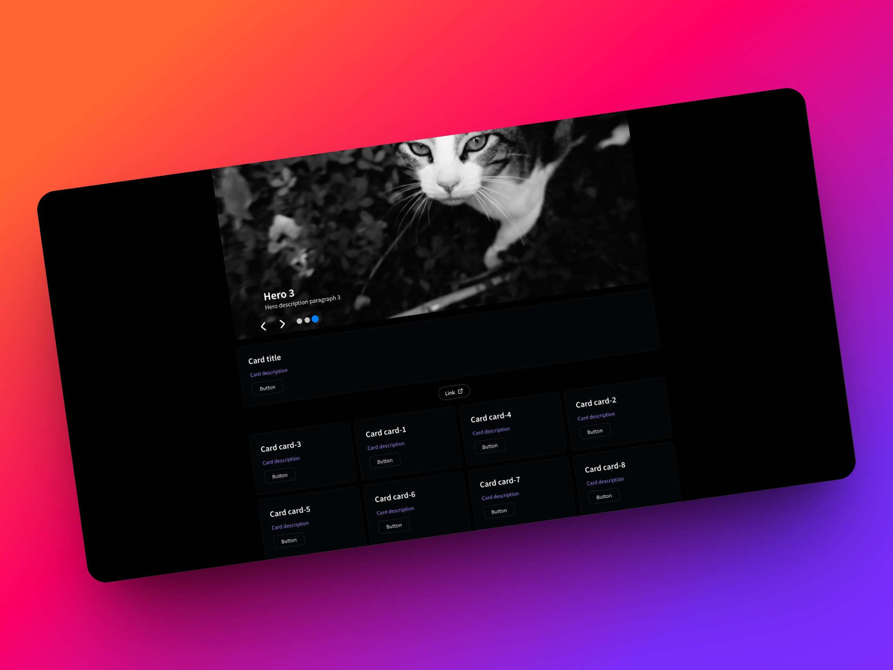
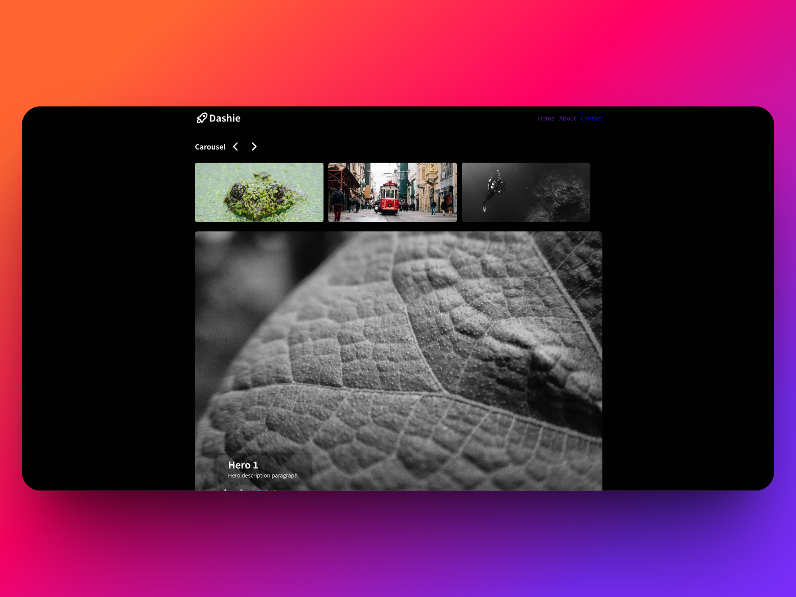

# Dashie

A modern web application to build custom components with React and TypeScript.

## Features
- Drag and drop functionality
- Carousel functionality
- Hero section functionality
- Modern UI built with React 19 and TypeScript
- Customizable components with Tabler Icons
- Responsive design with CSS variables
- Fast development with Vite

## Tech Stack

- **Frontend**: React 19, TypeScript
- **Styling**: CSS with Fontsource for custom fonts
- **Icons**: @tabler/icons-react
- **Build Tool**: Vite
- **Type Checking**: TypeScript

